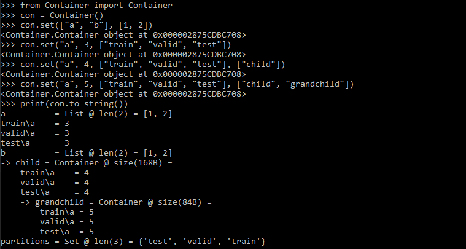

# HydroLearn: A Pipeline for Training Hydrologic ML Models
## Author(s): Nicholas Majeske
## Contact: nmajeske@iu.edu

## Requirements
Required packages are provided for conda environment setup or pip installation in environment.yml and requirements.txt respectively. Users may issue one of the following commands to install all dependencies for HydroLearn:
```bash
conda env create --file environment.yml
pip install -r requirements.txt
```
Users who wish to create an Anaconda environment with a specific name may find the following commmand useful:
```bash
conda create --name <env_name> --file requirements.txt
```

## Cloning
This repository contains submodules and will require the user to clone each before HydroLearn is operational. This repository and all submodules may be cloned at once using the --recurse-submodules flag. See examples below:
```bash
git clone https://github.com/HipGraph/HydroLearn_Dev.git --recurse-submodules
```
```bash
git clone git@github.com:HipGraph/HydroLearn_Dev.git --recurse-submodules
```

## Working with HydroLearn
### Containers
To maintain flexibility and manage the namespace, HydroLearn relies heavily on the Container class to store runtime data. Simply put, containers are python dictionaries with added functionality. Specifically, this added functionality facilitates the creation of hierarchical data structures with built-in partitioning. Below are just a few examples of working with the Container class:
##### Basic Variables
```python
# Basic operations for var "a" with value 1
con = Container()
con.set("a", 1)
a = con.get("a")
con.rem("a")
```
##### Partitioned Variables
```python
# Basic operations for var "a" with value 1 under partition "train"
con = Container()
con.set("a", 1, partition="train")
train_a = con.get("a", partition="train")
con.rem("a", "train"
```
##### Hierarchical Variables
```python
# Basic operations for var "a" with value 1 under partition "train" in child container "child"
con = Container()
con.set("a", 1, partition="train", context="child")
train_a = con.get("a", partition="train", context="child")
con.rem("a", partition="train", context="child")
```
##### Macro Operations
```python
con = Container()
con.set(["a", "b"], 1, "train") # Vars with same value & partition
a, b = con.get(["a", "b"], "train")
con.rem(["a", "b"], "train")
con.set(["a", "b"], 1, ["train", "test"]) # Vars with same value but different partitions
a, b = con.get(["a", "b"], ["train", "test"])
con.rem(["a", "b"], ["train", "test"])
con.set("a", 1, "*") # Var with any existing partition
a_vals = con.get("a", "*")
con.rem("a", "*")
```
##### Container Demo

### Quick Invocation
HydroLearn may be executed simply by invoking the Execute script:
```bash
python Execute.py
```
This will execute HydroLearn using all default settings defined in Variables.py. To change the execution of HydroLearn, users can provide command-line arguments similar to the example below:
```bash
python Execute.py --training:train true --evaluation:evaluate true --evaluation:evaluated_checkpoint \"Best\"
```
This invocation executes HydroLearn in train and evaluation modes and evaluates the model by checkpoint name "Best". HydroLearn employs a custom argument parser (implemented in Arguments.py) to convert command-line arguments to an equivalent Container instance. As such, it also employs a custom command-line argument syntax which is defined below. The example command-line arguments given above will be parsed into a container object of the following structure:
```python
-> training
    train = True
-> evaluating
    evaluate True
    evaluated_checkpoint "Best"
```
In this case, the parsed container consists of two child containers named "training" and "evaluating" consisting of the variable names and values specified by our command-line arguments. Command-line arguments take the following syntactic form:
```bash
--<sub-container_path:><partition__>arg_name arg_value
```
where <> indicates an optional field and elements include:
1. The argument flag "-\-"
2. The sub-container path for hierarchical arguments. For example, **-\-child:grandchild:arg_name arg_value** denotes an argument by name "arg_name" and value "arg_value" located in a sub-container "grandchild" of sub-container "child". Note that this path is colon-separated and must include a trailing colon if used. The equivalent non-hierarchical argument form is **-\-arg_name arg_value**
3. The partition this argument name-value pair is assigned to
3. The argument name (arg_name)
4. The argument value (arg_value)

After parsing command-line arguments to an equivalent container, HydroLearn merges this container into the default variables container (defined in Variables.py) and executes on this new variable set. Note that merging container B into container A consists of replacing the values of all common variables in A with the values of variables in container B. By default, hierarchical variables are merged in a one-to-one fashion but non-hierarchical variables are merged recursively. More specifically, non-hierarchical variables are propagated down all sub-containers replacing the value for each common variable name. This functionality allows users to set the value for all instances of a variable by providing a single non-hierachical argument rather than repeating the argument for each hierarchical instance. 
### The HydroLearn Driver
The Driver.py script supplies additional functionality for execution of HydroLearn including distributed, experiment, and analysis execution.
#### Experiment Design and Execution
Manually entering command-line arguments is time consuming and impractical for complex settings. To this end, the Experimentation package allows users to define experiments (argument sets for multiple invocations) as a module. With an experiment module Experimentation/MyExperiments.py, Driver.py can execute HydroLearn for each argument set defined in an experiment using:
```bash
python Driver.py --E \"MyExperiments\" --e 1
```
Here --E specifies the experiment module and --e specifies the experiment of that module to execute. Consider using the example module Experimentation/ExperimentTemplate.py to get started.
#### Analysis Design and Execution
It is common for the results of an experiment to require some form of processing to produce a final product (plots, tables, etc). To this end, the Analysis package allows users to define all post-processing routines for an experiment as a module. With an analysis module Analysis/MyAnalysis.py, Driver.py can execute all post-processing routines for an experiment using:
```bash
python Driver.py --A \"MyAnalysis\" --a 1
```
Here --A specifies the analysis module and --a specifies the post-processing routine of that module to execute. Consider using the example module Analysis/AnalysisTemplate.py to get started.
### Data Integration
In order to feed new data into HydroLearn, users will need to complete the following steps:
1. Verify data format  
    Dataset loading is currently implemented for spatial and spatiotemporal data. Loading assumes each data file is comma-separated (.csv) and requires the following format:
    - Spatial Data  
        For spatial data containing S spatial elements and F spatial features, loading requires the file to contain S lines of F comma-separated features.
    - Spatiotemporal Data  
        For spatiotemporal data containing T time-steps, S spatial elements, and F spatiotemporal features, loading requires the file to contain T x S lines of F comma-separated features.  
    For both spatial and spatiotemporal data, spatial elements must be listed contiguously (see Data/WabashRiver/Observed/Spatiotemporal.csv). 
    Finally, labels for each time-step and spatial element are required.
2. Create a dataset directory and add data files  
    All datasets are stored in their own sub-directory under Data. Simply create a new directory under Data and add all data files to it.
3. Implement a DatasetVariables module  
    The pipeline recognizes datasets by searching the Data directory (recursively) for all instances of DatasetVariables.py. 
    Users must implement this module and place the script file at the root of their dataset directory. 
    As an example, the Wabash River ground truth dataset is setup with its DatasetVariables.py module in Data/WabashRiver/Observed/. 
    To facilitate user implementation of the DatasetVariables module, a template is included under Data/DatasetVariablesTemplate.py and lists all variables that must be defined. 
    It is recommended that users start with this template and follow the Wabash River DatasetVariables module as an example.

### Model Integration
In order to add new models to HydroLearn, users will need to complete the following steps:
1. Implement a Model module  
    The pipeline recognizes models by searching the Models directory (non-recursively) for all modules with the exception of \_\_init\_\_.py, Model.py and ModelTemplate.py. 
    Model operations including initialization, optimization, prediction, etc, are defined and operated by the model itself while HydroLearn simply calls a select few functions.
    Currently, HydroLearn is designed assuming models are implemented in PyTorch but is flexible enough to allow the incorporation of models implemented in Tensorflow (see Models/GEOMAN.py). 
    As a result, models currently implemented for HydroLearn inherit from a Model class implemented in the Models/Model.py module and this class inherits from PyTorch's torch.nn.Module. 
    To facilitate user implementation of model modules, a template is included under Models/ModelTemplate.py. 
    It is recommended that users start with this template and follow the LSTM model module under Models/LSTM.py as an example. 
    
## Module Descriptions
1. Analysis/Analysis.py : Defines the base analysis class from which user-defined analysis classes must inherit.
2. Arguments.py : A module defining the argument parser and builder which parses command-line arguments into a Container object or builds command-line arguments from a Container object respectively.
3. Container.py : Hierarchical container class to facilitate partitioning of data. Widely used across HydroLearn as most data classes inherit from this class.
4. Data/Data.py : The all-encompassing data module that manages loading, caching, and processing of all datasets.
5. Data/Graph.py : Defines all routines for loading, pre-processing, partitioning, etc for graphical/geometrical data.
6. Data/SpatialData.py : Defines all routines for loading, pre-processing, partitioning, etc for data that is only spatially distributed.
7. Data/SpatiotemporalData.py : Defines all routines for loading, pre-processing, partitioning, etc for data that is both spatially and temporally distributed.
8. Driver.py : Handles execution of HydroLearn including distributed (or non-distributed) invocation of Execute.py, invocation of experiments, and invocation of analysis.
9. Experimentation/Experiment : Defines the base experiment class from which user-defined experiment classes must inherit.
10. Execute.py : The pipeline script which defines data loading, pre-processing, model training/evaluation, plotting, and more.
11. Models/Model.py : The module for PyTorch machine learning models. All models implemented will inherit from the Model class and, by inheritance, PyTorch's Module class. See Models/LSTM.py for an example.
12. Plotting.py : Defines all plotting routines.
13. Utility.py : Defines all miscellaneous/common routines.
14. Variables.py : Defines all variables and their default values.
